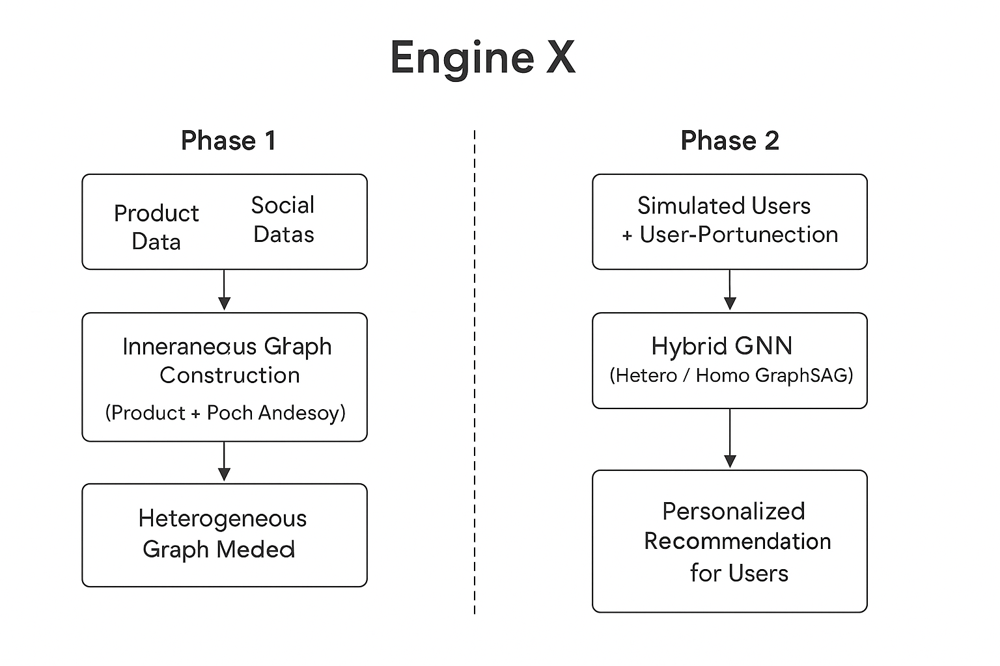

Got it! Let’s create a **full README** for **Engine X**, focusing on its multi-domain, hybrid GNN recommendation system. I’ll structure it professionally so it’s ready for GitHub or documentation.

---

# Engine X

## Overview

**Engine X** is an advanced **multi-domain hybrid recommendation system** leveraging the power of **Graph Neural Networks (GNNs)** and **transformer-based embeddings**. Unlike conventional recommendation engines that rely on single-domain data or collaborative filtering, Engine X integrates **multi-domain knowledge**, enabling personalized, cross-domain recommendations with higher accuracy.

The system is designed to handle **large-scale, heterogeneous datasets**, making it suitable for **e-commerce, content platforms, finance, and social networks**. By combining **graph-based relational reasoning** with **deep semantic embeddings**, Engine X predicts user preferences across different domains with a robust hybrid approach.

## Architecture



---

## Features

* **Multi-domain Recommendations:** Supports recommendation across multiple domains simultaneously.
* **Hybrid Architecture:** Combines **Graph Neural Networks (GNNs)** and **transformer-based embeddings** for improved accuracy.
* **Scalable:** Built with PyTorch and PyTorch Geometric, optimized for large datasets.
* **Customizable:** Easy to adapt for various types of data and domains.
* **High Performance:** Efficiently computes recommendations using **node embeddings**, **link prediction**, and **neighbor aggregation**.
* **Evaluation Metrics:** Supports precision, recall, F1-score, and mean reciprocal rank (MRR) for recommendation quality assessment.

---

## Architecture

Engine X comprises two main modules:

1. **Graph Neural Network Module**

   * Uses **GraphSAGE** for neighborhood aggregation.
   * Constructs user-item and item-item interaction graphs.
   * Generates node embeddings representing user preferences and item characteristics.

2. **Embedding & Recommendation Module**

   * Uses **Sentence Transformers** to encode textual or semantic information (e.g., product descriptions, reviews).
   * Combines graph embeddings with semantic embeddings for final recommendation scores.
   * Supports **top-k recommendations** per user and **cross-domain predictions**.

**Workflow Diagram:**

```
User & Item Data + Multi-Domain Features
               │
               ▼
        Graph Construction
               │
               ▼
      GraphSAGE Node Embeddings
               │
               ▼
  Semantic Embeddings (Transformer)
               │
               ▼
  Hybrid Embedding Fusion & Scoring
               │
               ▼
        Top-k Recommendations
```

---

## Installation

```bash
# Clone the repository
git clone https://github.com/yourusername/engine-x.git
cd engine-x

# Create virtual environment
python -m venv venv
source venv/bin/activate  # Linux/Mac
venv\Scripts\activate     # Windows

# Install dependencies
pip install -r requirements.txt
```

---

## Usage

```python
from engine_x import EngineX
import pandas as pd

# Load your data
user_data = pd.read_csv("data/users.csv")
item_data = pd.read_csv("data/items.csv")
interactions = pd.read_csv("data/interactions.csv")

# Initialize Engine X
model = EngineX(user_data, item_data, interactions)

# Train the model
model.train(epochs=50, lr=0.001)

# Generate recommendations
recommendations = model.recommend(user_id=123, top_k=10)
print(recommendations)
```

---

## Saving and Loading the Model

```python
# Save model
model.save("engine_x_model.pth")

# Load model
model.load("engine_x_model.pth")
```

---

## Evaluation

Engine X supports evaluating recommendation quality using:

```python
metrics = model.evaluate(test_data)
print(metrics)
# Output example: {'precision': 0.82, 'recall': 0.76, 'MRR': 0.79}
```

---

## Dependencies

* Python ≥ 3.9
* PyTorch ≥ 2.0
* PyTorch Geometric
* Sentence Transformers
* Pandas, NumPy

---

## Applications

* **E-commerce:** Personalized product recommendations across categories.
* **Streaming Platforms:** Suggesting movies, music, or shows based on user interests.
* **Finance:** Predicting financial products suitable for users.
* **Social Networks:** Friend suggestions or content recommendations.

---

## Contributing

1. Fork the repository
2. Create your feature branch (`git checkout -b feature/new-feature`)
3. Commit your changes (`git commit -am 'Add new feature'`)
4. Push to the branch (`git push origin feature/new-feature`)
5. Create a Pull Request

---

## License

MIT License © 2025 Mallikarjun Reddy Bardipuram

---

